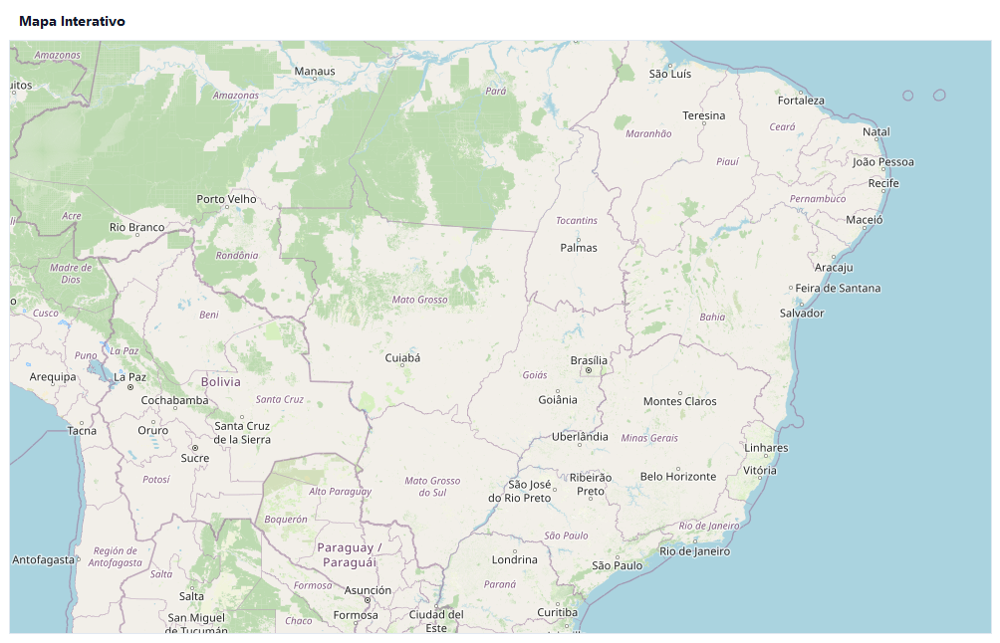
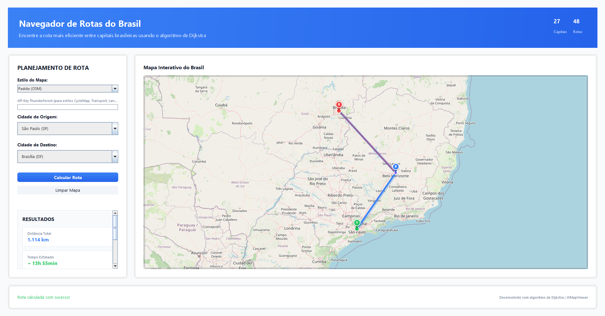
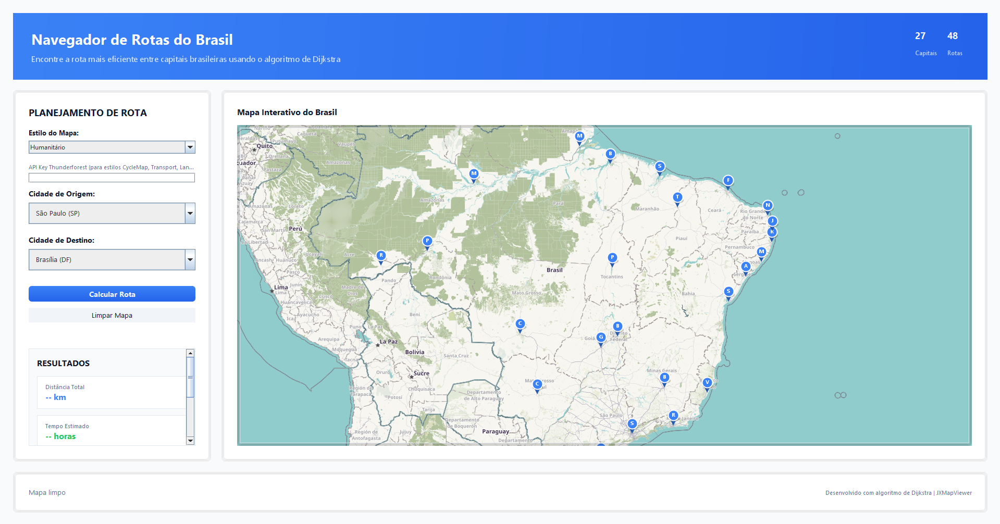

# Projeto Dijkstra Java

Este projeto foi criado como parte de um curso universitário com o objetivo de aplicar o algoritmo de Dijkstra em um grafo representado em Java com uma interface com `swing` e `awt`

## 🧠 Algoritmo de Dijkstra
O algoritmo de Dijkstra é utilizado para encontrar o caminho mais curto entre nós em um grafo, o que é útil em diversas aplicações, como redes de computadores, sistemas de navegação e análise de rede.

# 

<details>
  <summary style="cursor: pointer"><h2>📄 Informações do projeto</h2></summary>

  > Configurado e compilado em Java17<br>A aplicação acompanha uma biblioteca de mapa - `JXMapViwer2`

  

  ### Especificações gerais

  - Versão do java: [JDK17](https://www.oracle.com/java/technologies/javase/jdk17-archive-downloads.html)
  - Gerenciador de pacotes: [Maven 3.9.9](https://maven.apache.org/docs/3.9.9/release-notes.html)

  > Tabelando informações

  |Versão|Documentação|Download|
  |:---|:---:|:---|
  |JDK17|[Oracle](https://docs.oracle.com/en/java/javase/17/index.html)|[Incluindo todos JDK17](https://www.oracle.com/java/technologies/javase/jdk17-archive-downloads.html)|
  |Maven 3.9.9|[Maven Apache](https://maven.apache.org/docs/3.9.9/release-notes.html)|[.zip](https://repo.maven.apache.org/maven2/org/apache/maven/apache-maven/3.9.9/apache-maven-3.9.9-bin.zip) ou [List](https://maven.apache.org/download.cgi)|

  > Executar Build e Aplicação

  ```batch
  ./mvnw clean install package
  java -jar ./target/Mapa-Dijkstra-2.0.0.jar
  ```  
</details>

# 

## 💻 Apresentação
- [Slide de apresentação](https://www.canva.com/design/DAGmtqENOoE/T6WXAxBQxlyLmGmGss3gzQ/view?utm_content=DAGmtqENOoE&utm_campaign=designshare&utm_medium=link2&utm_source=uniquelinks&utlId=h6b6032b721)

  # Projeto em funcionamento
  
  
  
  

## 🧑‍💻 Contribuidors

- [@Dspofu](https://github.com/Dspofu)
- [@SammyKunimatsu](https://github.com/SammyKunimatsu)
- [@PedroCoelho04](https://github.com/pedrocoelho04)
